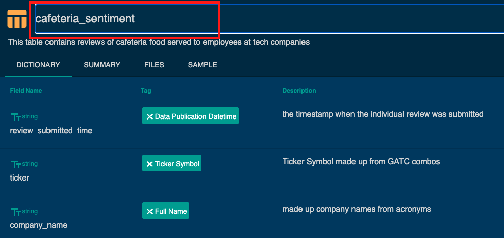
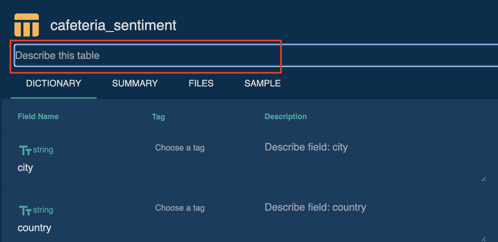
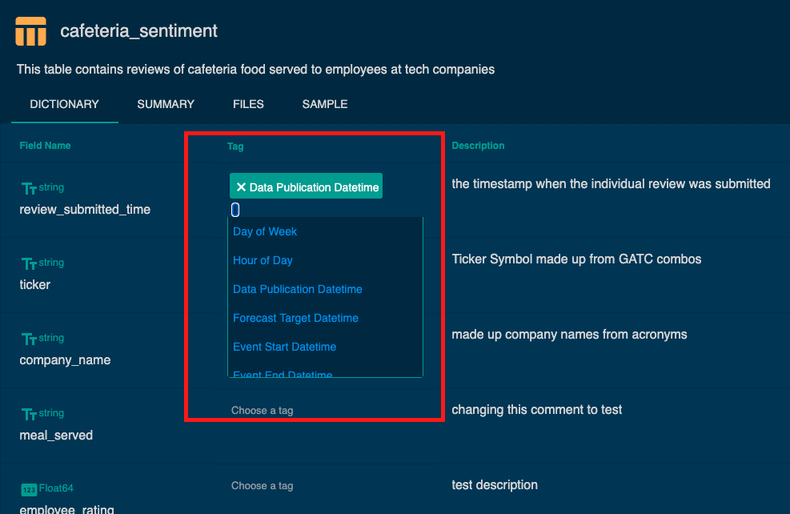
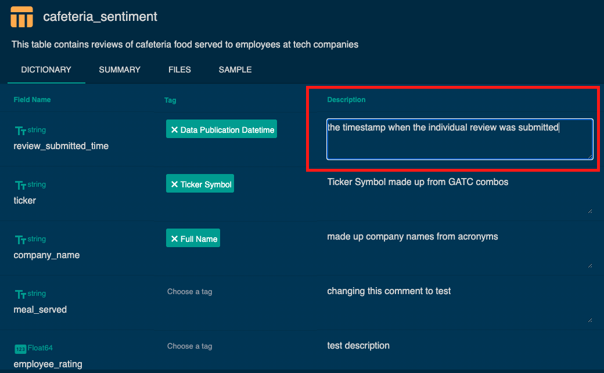
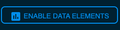
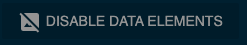

[Back to Table of Contents](../README.md) 
# Checklist for publishing a data-linked profile
_Vendor's action points on the platform to improve data presentation to the buyers_

## Changing Default Table Names
Go to 'Data Structure' section -->  Open the table card (single click) --> Click on current table name and change it --> Press 'Save' button after finishing adding the descriptions

## Adding Table Descriptions
Go to 'Data Stucture' panel -->  Open the table card (single click) --> Click on 'Describe this table' and type your description --> Press 'Save' button after finishing adding the descriptions

## Column Tagging

### Benefits of Tagging columns 
- categorization to improve understanding of the content of a column
- creation of an [entity coverage history element](data_linked_elements_contents.md#entity-coverage-history) for better coverage history presentation (adding an Entity-type tag and Datetime tag is required)
- lag a data sample [Data Structure table cards](data_linked_elements_contents.md) to restrict from display any data within the last 6 months to potential customer (adding at least one Datetime tag is required)

### How to tag columns
Go to 'Data Stucture' panel -->  Open the table card (single click) --> Go to 'Dictionary' tab --> Find the column you want to tag --> 'Chose a tag' (dropdown will occure) --> Press 'Save' button after finishing tagging

## Adding Column Descriptions
Go to 'Data Stucture' panel -->  Open the table card (single click) --> Go to 'Dictionary' tab --> Find the column you want to tag --> Put the description of fileds in the window --> Press 'Save' button after finishing adding the descriptions

## Enabling Data-linked Elements for Display
_Display/hide the data-linked elements to buyers_

All Data-linked elements described here are default hidden on your data profile to provide a sandbox environment for you to enrich these elements which further context before publishing. 

If you want to make the data-linked contents (e.g. Coverage, Data Structure, etc. ) visible for buyers, click __ENABLE DATA ELEMENTS__ in the content panel.
The button is located under the Section header of each data-linked section. 

If the element is already enabled, you can disable it from view on the buyer app at any time by clicking the __DISABLE DATA ELEMENTS__ option.

The overall dataset profile is still visible when the data-linked elements are disabled, however unpublishing the entire dataset profile will also restrict the buyer from having access to the data-linked elements of that profile, let alone the other profile content you contributed. 