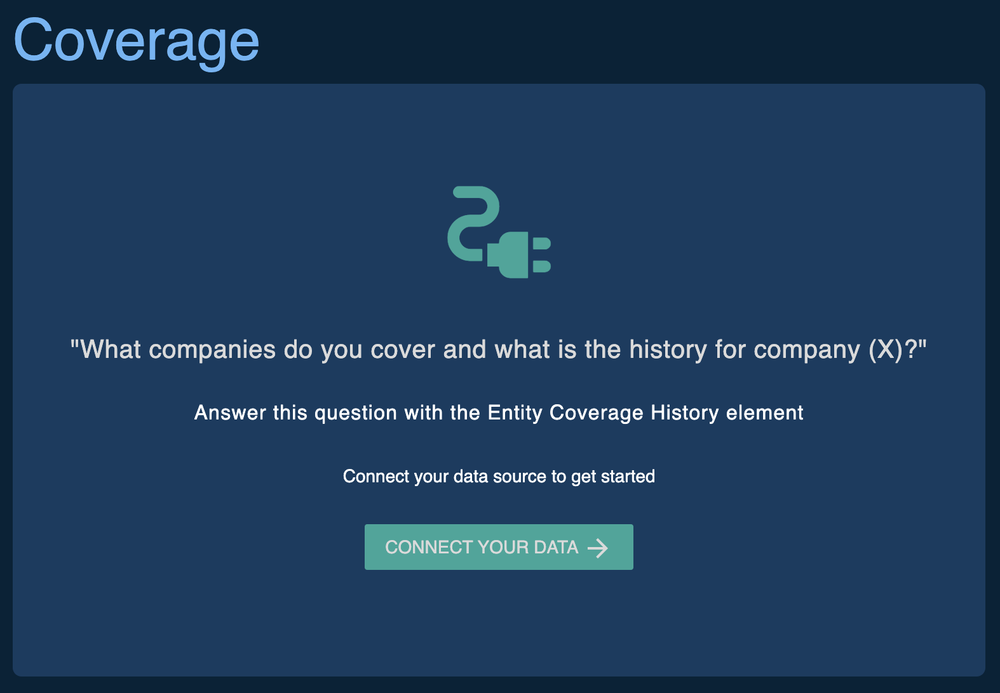
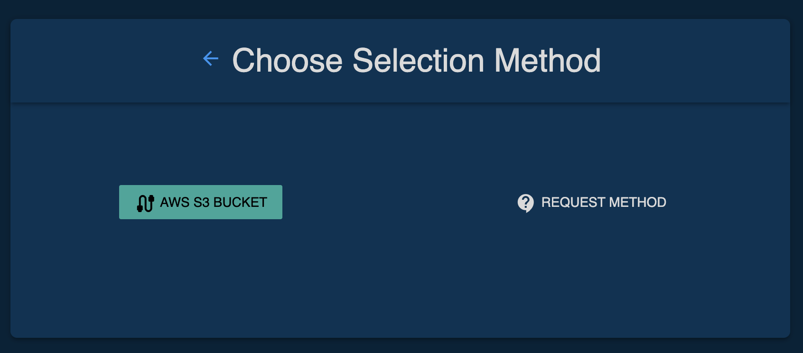
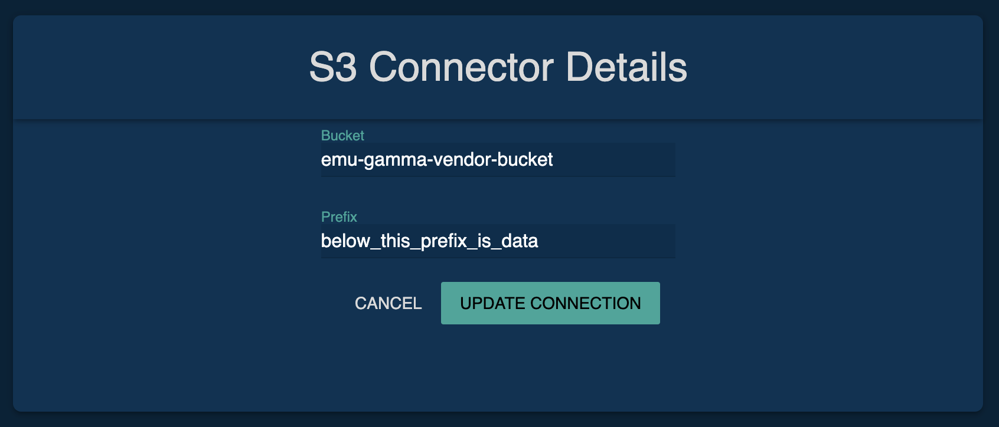
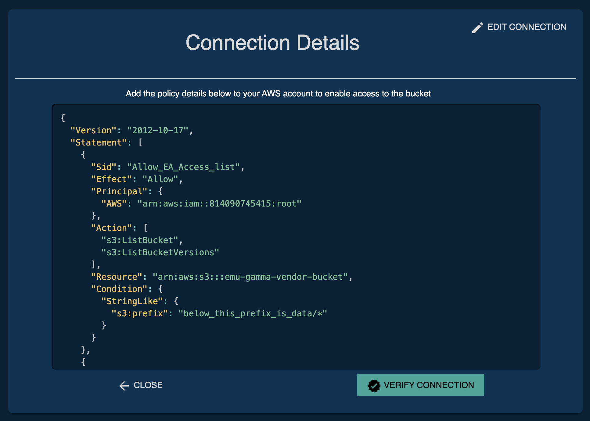
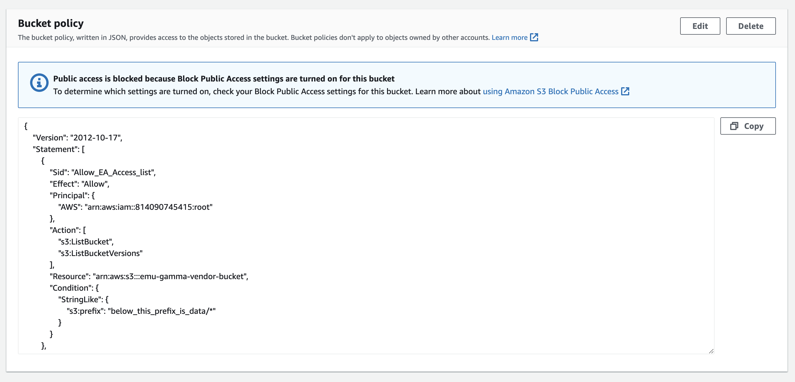

[Back to Table of Contents](../README.md) 
# Setting up a Data Connection

##  Connections We Currently Support
We currently offer fully self-service connection setup functionality to the following data locations:

- Vendor-owned AWS S3 Bucket (*Preferred*)

We also offer on-request connection services for the following setups:

- Eagle Alpha-owned AWS S3 Bucket with access granted to Vendor AWS account
- Eagle Alpha-owned AWS S3 Bucket and Eagle Alpha-managed AWS user credentials granted to Vendor

*Note that for both of the Eagle Alpha-owned AWS S3 Bucket setups, Eagle Alpha cannot back-validate the delivery history beyond the creation of the bucket and will only validate ongoing deliveries to the bucket*

##  Steps for connecting a Vendor-owned AWS S3 Bucket
1) Log into your vendor account on our platform and click on the dataset you want to set up the connection for to go to the profile.
2) Scroll down to the __Coverage__ section, click __Connect Your Data__

3) Select __AWS S3 Bucket__ as the method

4) Add the name of the Bucket where your data resides, and the prefix below which you want to give Eagle Alpha read access to.

5) Copy the Bucket Policy shown  and paste it into the Bucket Policy into the Bucket Policy section of your AWS Console by clicking __Edit__.  You can navigate directly to by adding your BUCKET NAME to this template url: 
    - s3.console.aws.amazon.com/s3/buckets/{BUCKET_NAME}?tab=permissions
6) After you have applied this policy in the AWS Console, go back to the Eagle Alpha platform and click __Verify Connection__. This will attempt to scan the contents of your S3 bucket and begin to construct the data elements discussed in the [Data-linked profile elements](data_linked_elements_contents.md) section. 
