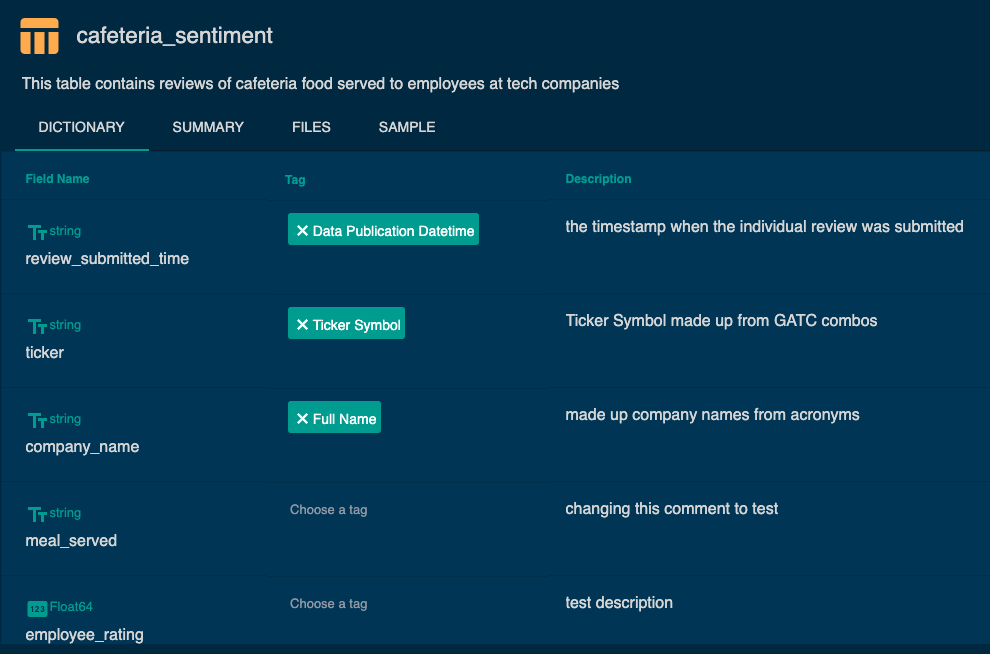

[Back to Table of Contents](../README.md) 
# Data-linked Profile Elements

##  Entity Coverage History
_"What companies do you cover and what is the history for company (X)?"_ 
#### Answer this question with the Entity Coverage History element

The entity coverage history element depends on the designation of two column types with data dictionary tags: 
- entity column(s): any columns that partially or wholly describe an entity in your data 
- datetime column: single column that is the primary publication datetime

The element will start displaying on your data profile after tagging the above columns for at least one table in the data. To learn how to specify the entity and datetime columns, read the section on [How to tag columns](check_for_publishing_data_linked_profile.md#column-tagging).

To search and filter for specific entities, click the dropdown on the top left of the chart (red box below). The values displayed there are the unique combinations of the tagged entity columns present in your designated table. 

_Note: we currently do not support multi-table joins (e.g. to bring in further entity detail) or displaying the coverage for/from multiple tables...yet!_

## Data Structure 
_An in-depth, always up-to-date summary of your actual data product._
#### Samples, Dictionaries, and more for every table in your data.

After conection to Eagle Alpha, you can find your data presented in 'Data Structure' content. The data will be divided into table cards with general info about each of them (number of columns, rows, files and size of tables). 

After single click on the table card, the table details will be display:
1) Dictionary tab - contains detailed information about each of columns in the table:
- column names
- column tags (if already added)
- column description (if already added).

Adding, editing or deleting tags or description is possible in here. Changes are saved after pressing 'Save' button.

2) Summary tab - general data specification.

3) Files tab - source of data as a list of files names.

4) Sample tab - example of 100 rows from the table.

If a Datetime tag is applied to a column (in the Dictionary tab), the sample that is generated will only display data that is lagged by at least 6 months.

## Delivery History 
_Build point-in-time confidence in your data._
#### Validate your data delivery with Eagle Alpha as a trusted 3rd-party.

The delivery history element depicts temporal characteristics of your ongoing data delivery. Separated into a per-day calendar view visualization and a per-hour year-long summarization, you can present both the lnog-distance and time-of-day characteristics of your data publications. 

*Please note that the time-of-publication is derived from the S3 bucket object metadata, not any column information contained in your published data files, meaning only buckets where you have been publishing data to historically will be back-validated.*

Selecting a year button or an aggregation type button change both the by year and by hour plots. Aggregation types that are summarized include:
- __Files__: Count of Files within that temporal bin
- __Size__: Sum total of File Size within that temporal bin
- __Tables__: Count of Tables that had Files published to them within that temporal bin. Tables are defined in the Data Structure seciton
- __Events__: Count of Delivery Events within that temporal span. Events are defined as any number of Files added, deleted or modified within a unique one-hour timeframe. 

*Please note this element is not directly editable, however any name change or merge to Tables that takes place in the Data Structure setup will automatically be propagated here.*

